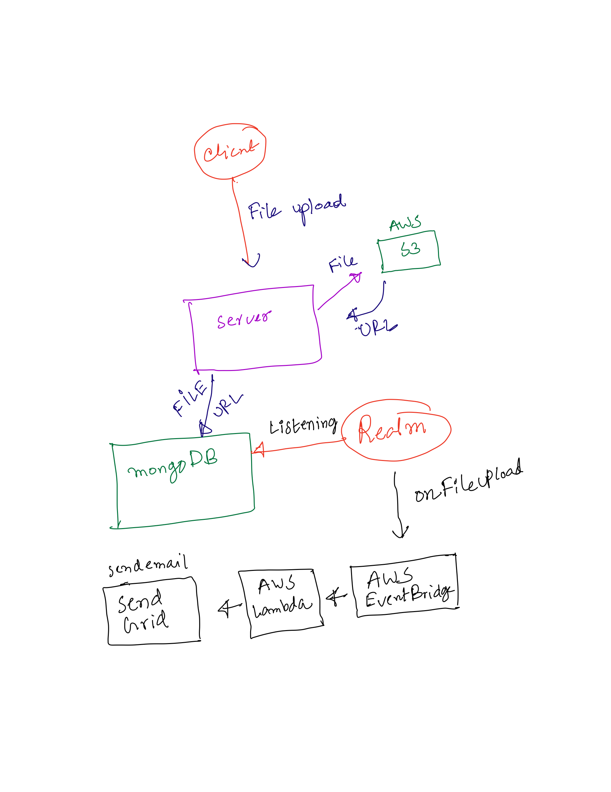

# Web development assignment
This is a coding assignment for Basis Europe, A basic file uploading system for customers.

[See Live Demo](https://basis-support-app.herokuapp.com/)

This project uses the [MEAN stack](https://en.wikipedia.org/wiki/MEAN_(solution_stack)):
* [**M**ongoose.js](http://www.mongoosejs.com) ([MongoDB](https://www.mongodb.com)): Database
* [**E**xpress.js](http://expressjs.com): Backend framework
* [**A**ngular](https://angular.io): Frontend framework
* [**N**ode.js](https://nodejs.org): Runtime environment

Other tools and technologies used:
* [Angular CLI](https://cli.angular.io): Frontend scaffolding
* [Bootstrap](http://www.getbootstrap.com): Layout and styles
* [Font Awesome](http://fontawesome.com): Icons
* [JSON Web Token](https://jwt.io): User authentication
* [Angular JWT](https://github.com/auth0/angular2-jwt): JWT helper for Angular
* [Bcrypt.js](https://github.com/dcodeIO/bcrypt.js): password encryption

## Prerequisites
1. Install [Node.js(14.9.0)](https://nodejs.org) and [MongoDB](https://www.mongodb.com)
2. Install Angular CLI(11.0.3): `npm i -g @angular/cli`
3. From project root folder install all the dependencies: `npm i`

## High Level Components

(Some component still need to be done…)

## Developing
### Development mode
`npm run dev`: [concurrently](https://github.com/kimmobrunfeldt/concurrently) execute MongoDB, Angular build, TypeScript compiler and Express server.

A window will automatically open at [localhost:4200](http://localhost:4200). Angular and Express files are being watched. Any change automatically creates a new bundle, restart Express server and reload your browser.

### Production mode
`npm run prod`: run the project with a production bundle and AOT compilation listening at [localhost:3000](http://localhost:3000)

### Docker
1. `docker-compose up`
2. Go to [localhost:3000](http://localhost:3000)

### Deployment to Heroku

* Download and install [Heroku Toolbelt](https://toolbelt.heroku.com/)
* In a terminal, run `heroku login` and enter your Heroku credentials
* From *your app* directory run `heroku create`
* Use the command `heroku config:set KEY=val` to set the different environment variables (KEY=val) for your application
(i.e.  `heroku config:set BASE_URL=[heroku App Name].herokuapp.com` or `heroku config:set MONGODB_URI=mongodb://dbuser:<password>@cluster0-shard-00-00-sdf32.mongodb.net:27017,cluster0-shard-00-01-sdf32.mongodb.net:27017/<dbname>?ssl=true&retryWrites=true&w=majority` (see Hosted MongoDB Atlas below), etc.)  Make sure to set the environment variables for SENDGRID_USER, SENDGRID_PASSWORD, and any other API that you are using as well.
* Lastly, do `git push heroku master`.

Please note that you may also use the [Herko Dashboard](https://dashboard.heroku.com) to set or modify the configurations for your application.

or

[Deploy to Heroku](https://heroku.com/deploy)

### Deploying to AWS EC2
1. Create a EC2 Linux machine on AWS
2. Edit the EC2 Security Group and add TCP port `3000` as an Inbound rule for Source `0.0.0.0/0`
3. Clone this repo into the EC2 machine
4. If you use a remote MongoDB instance, edit `.env` file
5. Run `npm ci`
6. Run `npm run build` or `npm run buildprod`
7. Run `npm start`
8. The app is now running and listening on port 3000
9. You can now visit the public IP of your AWS EC2 followed by the port, eg: `12.34.56.78:3000`
10. Tip: use [pm2](https://pm2.keymetrics.io/) to run the app instead of `npm start`, eg: `pm2 start dist/server/app.js`

- - - -
## Running tests
Run `ng test` to execute the frontend unit tests via [Karma](https://karma-runner.github.io).

Run `npm run testbe` to execute the backend tests via [Mocha](https://mochajs.org/) (it requires `mongod` already running).

## Running linters
Run `npm run lint` to execute [TS linting](https://github.com/palantir/tslint), [HTML linting](https://github.com/htmlhint/HTMLHint) and [SASS linting](https://github.com/sasstools/sass-lint).

## Further help
To get more help on the `angular-cli` use `ng --help` or go check out the [Angular-CLI README](https://github.com/angular/angular-cli/blob/master/README.md).

### Author
* [Saadnoor Salehin](https://github.com/saadnoor)
